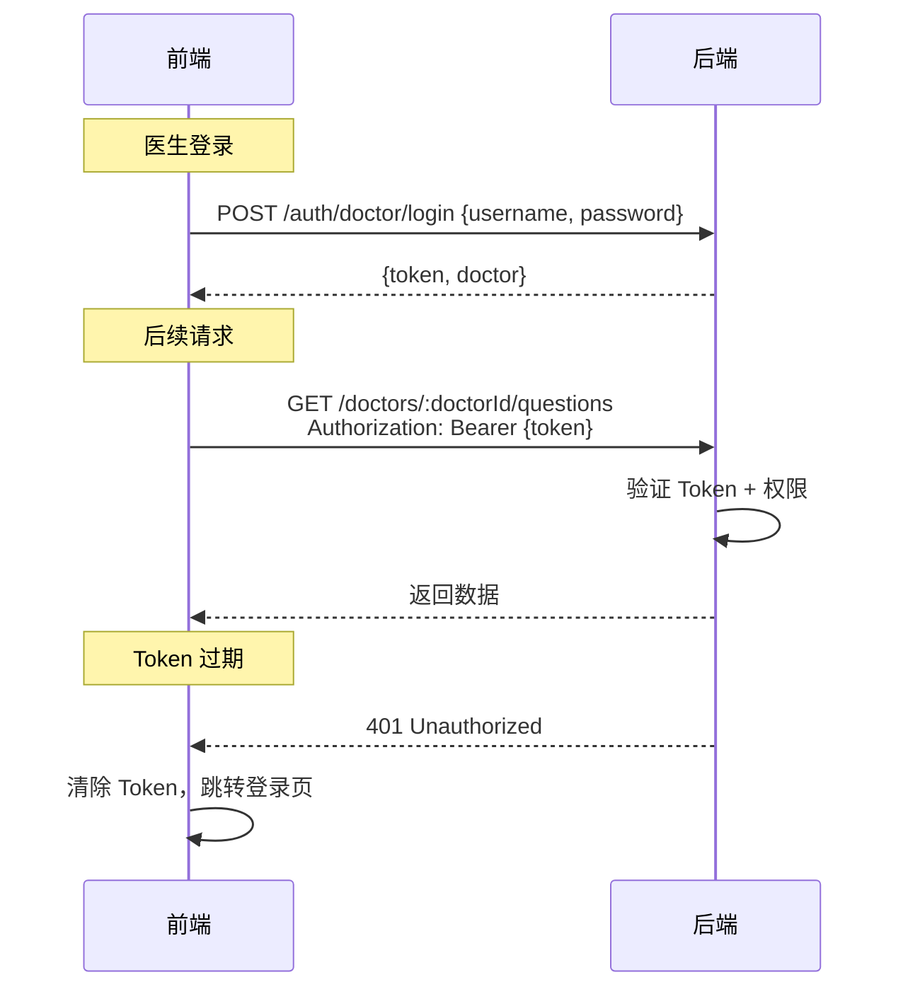
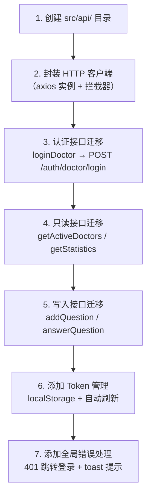

# API 接口文档

## 概述

**当前状态**: QA Live Healthcare 是纯前端 SPA，**无后端 API 调用**。所有数据操作通过 `src/store/index.ts` 的内存方法完成。

**本文档定位**: 作为未来后端对接的 API 设计规范。每个 API 端点均标注了对应的现有 store 方法，便于前端迁移时逐个替换。

---

## API 设计规范

### 通用约定

| 规范项 | 值 |
|--------|-----|
| 协议 | HTTPS |
| 数据格式 | JSON |
| 字符编码 | UTF-8 |
| 认证方式 | JWT Token（Bearer） |
| 版本控制 | URL 路径前缀 `/v1` |
| 响应格式 | `{ code, message, data }` |

### 统一响应格式

```typescript
// 成功响应
interface ApiResponse<T> {
  code: number;       // 业务状态码，200 表示成功
  message: string;    // 状态描述
  data: T;            // 业务数据
}

// 错误响应
interface ApiErrorResponse {
  code: number;       // 错误码（400/401/403/404/500）
  message: string;    // 错误描述
  data: null;
  errors?: {          // 可选，参数校验错误详情
    field: string;
    message: string;
  }[];
}
```

### HTTP 状态码

| 状态码 | 含义 | 使用场景 |
|--------|------|----------|
| 200 | 成功 | 查询、更新、删除 |
| 201 | 创建成功 | 新增资源 |
| 400 | 参数错误 | 请求体校验失败 |
| 401 | 未认证 | Token 缺失或过期 |
| 403 | 无权限 | 角色不匹配 |
| 404 | 不存在 | 资源未找到 |
| 500 | 服务器错误 | 未预期异常 |

### 基础 URL

```
生产环境: https://api.qalive.com/v1
开发环境: http://localhost:3000/v1
```

---

## 接口清单与 Store 映射

```mermaid
graph LR
    subgraph 前端 Store 方法（当前）
        S1[store.loginDoctor]
        S2[store.verifyPatient]
        S3[store.logoutDoctor / logoutPatient]
        S4[store.getActiveDoctors]
        S5[store.getDoctorByUsername]
        S6[store.getQuestionsByDoctor]
        S7[store.getQuestionsByPatient]
        S8[store.addQuestion]
        S9[store.answerQuestion]
        S10[store.markQuestionAsAnswered]
        S11[store.getStatistics]
    end

    subgraph 未来 API 端点
        A1[POST /auth/doctor/login]
        A2[POST /auth/patient/verify]
        A3[POST /auth/logout]
        A4[GET /doctors?isActive=true]
        A5[GET /doctors/:username]
        A6[GET /doctors/:doctorId/questions]
        A7[GET /patients/:patientId/questions]
        A8[POST /questions]
        A9[POST /questions/:id/answer]
        A10[PUT /questions/:id/mark-answered]
        A11[GET /statistics]
    end

    S1 -.->|替换| A1
    S2 -.->|替换| A2
    S3 -.->|替换| A3
    S4 -.->|替换| A4
    S5 -.->|替换| A5
    S6 -.->|替换| A6
    S7 -.->|替换| A7
    S8 -.->|替换| A8
    S9 -.->|替换| A9
    S10 -.->|替换| A10
    S11 -.->|替换| A11
```

---

## 认证接口

### POST /auth/doctor/login

> **替换**: `store.loginDoctor(username, password)` (`src/store/index.ts:59`)

医生登录，返回 JWT Token。

**请求**:
```json
{
  "username": "dr-zhang-wei",
  "password": "123456"
}
```

| 字段 | 类型 | 必填 | 说明 |
|------|------|------|------|
| username | string | 是 | 登录用户名 |
| password | string | 是 | 登录密码 |

**成功响应** `200`:
```json
{
  "code": 200,
  "message": "登录成功",
  "data": {
    "token": "eyJhbGciOiJIUzI1NiIsInR5cCI6IkpXVCJ9...",
    "expiresIn": 86400,
    "doctor": {
      "id": "doc001",
      "username": "dr-zhang-wei",
      "name": "张伟医生",
      "title": "主任医师",
      "department": "心内科",
      "avatar": "https://images.pexels.com/photos/5215024/pexels-photo-5215024.jpeg?auto=compress&cs=tinysrgb&w=400",
      "experience": "15年临床经验",
      "specialties": ["高血压", "冠心病", "心律失常"],
      "isActive": true
    }
  }
}
```

**错误响应** `401`:
```json
{
  "code": 401,
  "message": "用户名或密码错误",
  "data": null
}
```

---

### POST /auth/patient/verify

> **替换**: `store.verifyPatient(name, birthday)` (`src/store/index.ts:74`)

患者身份验证。同名同生日视为同一患者，不存在则自动创建。

**请求**:
```json
{
  "name": "赵明",
  "birthday": "1985-03-15"
}
```

| 字段 | 类型 | 必填 | 说明 |
|------|------|------|------|
| name | string | 是 | 患者姓名 |
| birthday | string | 是 | 生日，格式 YYYY-MM-DD |

**成功响应** `200`:
```json
{
  "code": 200,
  "message": "验证成功",
  "data": {
    "id": "patient001",
    "name": "赵明",
    "birthday": "1985-03-15",
    "phone": "138****1234",
    "gender": "男",
    "token": "eyJhbGciOiJIUzI1NiIsInR5cCI6IkpXVCJ9...",
    "isNewUser": false
  }
}
```

> `isNewUser` 字段用于前端区分"欢迎回来"和"首次创建账户"提示。

---

## 医生接口

### GET /doctors

> **替换**: `store.state.doctors`（全量访问）

获取医生列表，支持筛选和分页。

**查询参数**:

| 参数 | 类型 | 必填 | 默认值 | 说明 |
|------|------|------|--------|------|
| department | string | 否 | — | 按科室筛选 |
| isActive | boolean | 否 | — | 按在线状态筛选 |
| page | number | 否 | 1 | 页码 |
| pageSize | number | 否 | 10 | 每页数量 |

**成功响应** `200`:
```json
{
  "code": 200,
  "message": "success",
  "data": {
    "list": [
      {
        "id": "doc001",
        "username": "dr-zhang-wei",
        "name": "张伟医生",
        "title": "主任医师",
        "department": "心内科",
        "avatar": "https://images.pexels.com/photos/5215024/pexels-photo-5215024.jpeg?auto=compress&cs=tinysrgb&w=400",
        "experience": "15年临床经验",
        "specialties": ["高血压", "冠心病", "心律失常"],
        "isActive": true
      }
    ],
    "pagination": {
      "page": 1,
      "pageSize": 10,
      "total": 5,
      "totalPages": 1
    }
  }
}
```

---

### GET /doctors/online

> **替换**: `store.getActiveDoctors()` (`src/store/index.ts:141`)

获取当前在线的医生列表（`isActive === true`）。

**成功响应** `200`:
```json
{
  "code": 200,
  "message": "success",
  "data": [
    {
      "id": "doc001",
      "username": "dr-zhang-wei",
      "name": "张伟医生",
      "title": "主任医师",
      "department": "心内科",
      "avatar": "https://images.pexels.com/photos/5215024/pexels-photo-5215024.jpeg?auto=compress&cs=tinysrgb&w=400",
      "specialties": ["高血压", "冠心病", "心律失常"]
    },
    {
      "id": "doc002",
      "username": "dr-li-na",
      "name": "李娜医生",
      "title": "副主任医师",
      "department": "儿科",
      "avatar": "https://images.pexels.com/photos/5327585/pexels-photo-5327585.jpeg?auto=compress&cs=tinysrgb&w=400",
      "specialties": ["儿童感冒", "儿童发育", "疫苗接种"]
    }
  ]
}
```

---

### GET /doctors/:username

> **替换**: `store.getDoctorByUsername(username)` (`src/store/index.ts:137`)

按用户名获取医生信息（用于诊室页面）。

**路径参数**:

| 参数 | 类型 | 说明 |
|------|------|------|
| username | string | 医生用户名，如 `dr-zhang-wei` |

**成功响应** `200`:
```json
{
  "code": 200,
  "message": "success",
  "data": {
    "id": "doc001",
    "username": "dr-zhang-wei",
    "name": "张伟医生",
    "title": "主任医师",
    "department": "心内科",
    "avatar": "https://images.pexels.com/photos/5215024/pexels-photo-5215024.jpeg?auto=compress&cs=tinysrgb&w=400",
    "experience": "15年临床经验",
    "specialties": ["高血压", "冠心病", "心律失常"],
    "isActive": true
  }
}
```

**错误响应** `404`:
```json
{
  "code": 404,
  "message": "医生不存在",
  "data": null
}
```

---

## 问诊问题接口

### POST /questions

> **替换**: `store.addQuestion(data)` (`src/store/index.ts:106`)

患者提交问诊问题。需要患者 Token。

**请求头**: `Authorization: Bearer {token}`

**请求**:
```json
{
  "doctorId": "doc001",
  "question": "最近总是感觉胸闷气短,特别是爬楼梯的时候,这是什么原因?"
}
```

| 字段 | 类型 | 必填 | 说明 |
|------|------|------|------|
| doctorId | string | 是 | 目标医生 ID |
| question | string | 是 | 问题内容（非空） |

**成功响应** `201`:
```json
{
  "code": 200,
  "message": "问题提交成功",
  "data": {
    "id": "q1748234567890",
    "patientId": "patient001",
    "patientName": "赵明",
    "doctorId": "doc001",
    "doctorName": "张伟医生",
    "question": "最近总是感觉胸闷气短,特别是爬楼梯的时候,这是什么原因?",
    "submitTime": "2026-04-22T14:30:00.000Z",
    "status": "pending",
    "answer": null,
    "answerTime": null
  }
}
```

> **前端迁移注意**: 当前 `addQuestion` 接收 `Omit<Question, 'id'|'submitTime'|'status'|'answer'|'answerTime'>`，后端接口应自动填充 `id`、`submitTime`、`status`、`patientId`、`patientName`、`doctorName`（从 Token 和 doctorId 推导）。

---

### GET /doctors/:doctorId/questions

> **替换**: `store.getQuestionsByDoctor(doctorId)` (`src/store/index.ts:98`)

获取指定医生收到的所有问题。需要医生 Token。

**请求头**: `Authorization: Bearer {token}`

**路径参数**:

| 参数 | 类型 | 说明 |
|------|------|------|
| doctorId | string | 医生 ID |

**查询参数**:

| 参数 | 类型 | 必填 | 说明 |
|------|------|------|------|
| status | string | 否 | 筛选：`pending` / `answered` |

**成功响应** `200`:
```json
{
  "code": 200,
  "message": "success",
  "data": {
    "pending": [
      {
        "id": "q004",
        "patientId": "patient001",
        "patientName": "赵明",
        "question": "血压最近有点高,早上测量是145/95,需要吃降压药吗?",
        "submitTime": "2025-11-02T14:20:00",
        "status": "pending"
      }
    ],
    "answered": [
      {
        "id": "q001",
        "patientId": "patient001",
        "patientName": "赵明",
        "question": "最近总是感觉胸闷气短,特别是爬楼梯的时候,这是什么原因?",
        "submitTime": "2025-11-02T09:30:00",
        "status": "answered",
        "answer": "根据您的描述,可能是心脏功能问题。建议您做个心电图和心脏彩超检查,同时注意休息,避免剧烈运动。",
        "answerTime": "2025-11-02T09:45:00"
      }
    ]
  }
}
```

---

### GET /patients/:patientId/questions

> **替换**: `store.getQuestionsByPatient(patientId)` (`src/store/index.ts:102`)

获取指定患者提交的所有问题。需要患者 Token。

**请求头**: `Authorization: Bearer {token}`

**成功响应** `200`:
```json
{
  "code": 200,
  "message": "success",
  "data": {
    "list": [
      {
        "id": "q001",
        "doctorId": "doc001",
        "doctorName": "张伟医生",
        "question": "最近总是感觉胸闷气短,特别是爬楼梯的时候,这是什么原因?",
        "submitTime": "2025-11-02T09:30:00",
        "status": "answered",
        "answer": "根据您的描述,可能是心脏功能问题。建议您做个心电图和心脏彩超检查,同时注意休息,避免剧烈运动。",
        "answerTime": "2025-11-02T09:45:00"
      },
      {
        "id": "q004",
        "doctorId": "doc001",
        "doctorName": "张伟医生",
        "question": "血压最近有点高,早上测量是145/95,需要吃降压药吗?",
        "submitTime": "2025-11-02T14:20:00",
        "status": "pending",
        "answer": null,
        "answerTime": null
      }
    ],
    "pagination": {
      "page": 1,
      "pageSize": 10,
      "total": 2,
      "totalPages": 1
    }
  }
}
```

---

### POST /questions/:questionId/answer

> **替换**: `store.answerQuestion(questionId, answer)` (`src/store/index.ts:119`)

医生文字回复问题。需要医生 Token。

**请求头**: `Authorization: Bearer {token}`

**路径参数**:

| 参数 | 类型 | 说明 |
|------|------|------|
| questionId | string | 问题 ID |

**请求**:
```json
{
  "answer": "建议您先做心电图检查，同时注意休息，避免剧烈运动。"
}
```

| 字段 | 类型 | 必填 | 说明 |
|------|------|------|------|
| answer | string | 是 | 回复内容，非空 |

**成功响应** `200`:
```json
{
  "code": 200,
  "message": "回复成功",
  "data": {
    "id": "q001",
    "status": "answered",
    "answer": "建议您先做心电图检查，同时注意休息，避免剧烈运动。",
    "answerTime": "2026-04-22T15:00:00.000Z"
  }
}
```

**错误响应** `400`:
```json
{
  "code": 400,
  "message": "问题已回复或不存在",
  "data": null
}
```

---

### PUT /questions/:questionId/mark-answered

> **替换**: `store.markQuestionAsAnswered(questionId)` (`src/store/index.ts:128`)

医生标记问题为已口述解答（无文字回复，answer 固定为 "已口述解答"）。需要医生 Token。

**请求头**: `Authorization: Bearer {token}`

**成功响应** `200`:
```json
{
  "code": 200,
  "message": "标记成功",
  "data": {
    "id": "q004",
    "status": "answered",
    "answer": "已口述解答",
    "answerTime": "2026-04-22T15:05:00.000Z"
  }
}
```

---

## 统计接口

### GET /statistics

> **替换**: `store.getStatistics()` (`src/store/index.ts:145`)

获取系统统计数据，用于首页统计卡片。

**成功响应** `200`:
```json
{
  "code": 200,
  "message": "success",
  "data": {
    "totalDoctors": 5,
    "totalQuestions": 7,
    "activeSessions": 4,
    "totalSessions": 4
  }
}
```

**字段与首页卡片的对应关系**:

| API 字段 | 首页卡片文案 | 计算逻辑 |
|----------|-------------|----------|
| totalDoctors | 专业医生 | `doctors.length` |
| totalQuestions | 问题总数 | `questions.length` |
| activeSessions | 待响应问题 | `questions.filter(q => q.status === 'pending').length` |
| totalSessions | 在线诊室 | `doctors.filter(d => d.isActive).length` |

---

## 科室数据字典

| 科室名称 | 对应医生 |
|----------|----------|
| 心内科 | 张伟医生 (doc001) |
| 儿科 | 李娜医生 (doc002) |
| 骨科 | 王强医生 (doc003) |
| 妇产科 | 刘敏医生 (doc004) |
| 消化内科 | 陈杰医生 (doc005) |

---

## 安全规范

### JWT 认证流程



### 安全要求

| 项目 | 当前状态 | 目标状态 |
|------|----------|----------|
| 密码存储 | 明文 JSON | BCrypt 哈希 |
| 传输加密 | HTTP (dev) | HTTPS |
| 认证方式 | 无 (内存状态) | JWT Token |
| 接口鉴权 | 无 | Bearer Token + 角色校验 |
| 输入校验 | 前端 only | 前端 + 后端双重校验 |

---

## 前端迁移指南

对接后端时，建议按以下顺序替换 store 方法：



### axios 封装示例

```typescript
// src/api/request.ts
import axios from 'axios';
import { message } from 'ant-design-vue';

const api = axios.create({
  baseURL: '/v1',
  timeout: 10000,
});

// 请求拦截器：注入 Token
api.interceptors.request.use(config => {
  const token = localStorage.getItem('token');
  if (token) {
    config.headers.Authorization = `Bearer ${token}`;
  }
  return config;
});

// 响应拦截器：统一错误处理
api.interceptors.response.use(
  response => response.data.data,
  error => {
    if (error.response?.status === 401) {
      localStorage.removeItem('token');
      window.location.href = '/doctor/login';
    } else {
      message.error(error.response?.data?.message || '请求失败');
    }
    return Promise.reject(error);
  }
);

export default api;
```

---

*最后更新: 2026-04-22*
*由 Context Builder 工具集生成*
