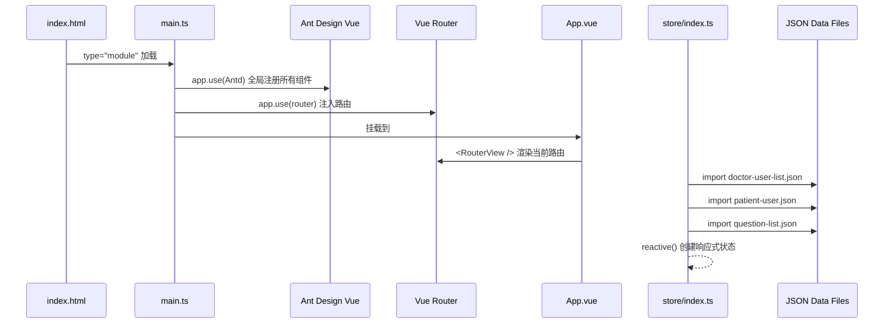
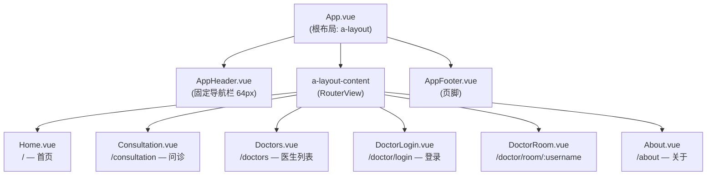
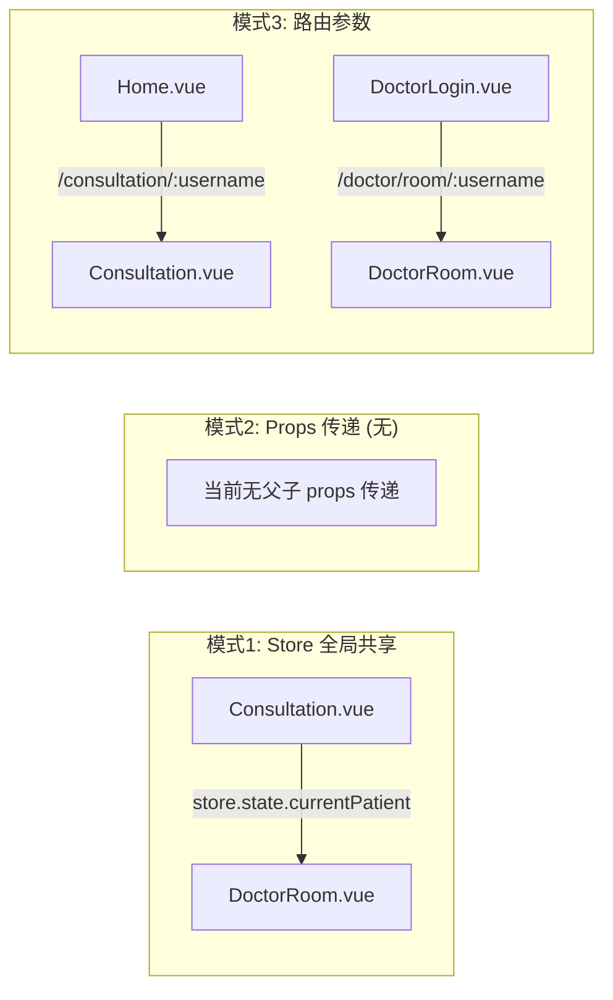
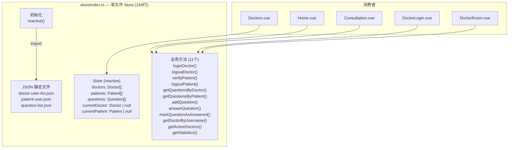
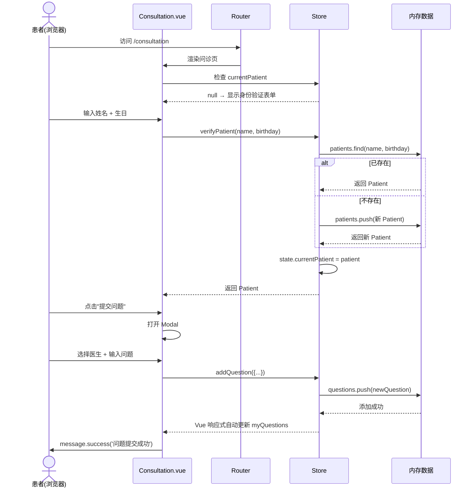
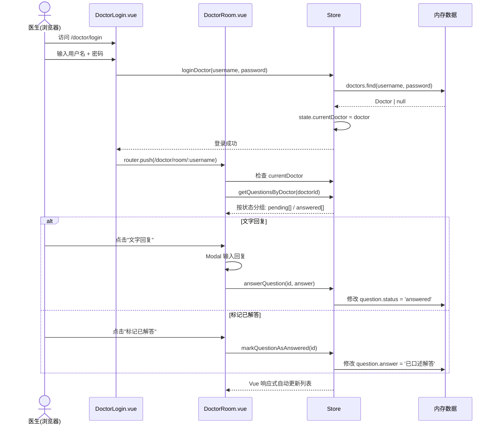
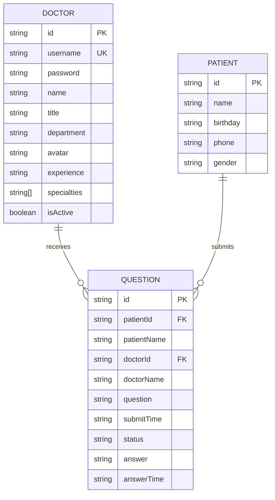
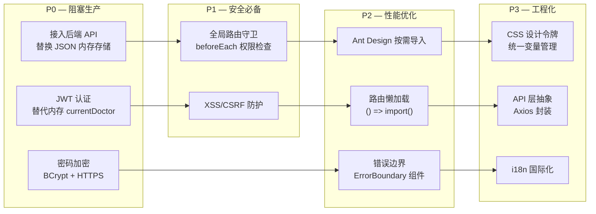

# QA Live Healthcare 系统架构文档

## 1. 架构概述

### 1.1 项目定位

**QA Live Healthcare** 是一个纯前端单页应用（SPA），面向在线医疗咨询场景。目前处于**原型/MVP 阶段**，所有数据存储在前端内存中（`reactive` 状态 + JSON 静态文件），无后端服务、无数据库、无认证中间件。

### 1.2 整体架构

```
┌──────────────────────────────────────────────────────────────────┐
│                         浏览器 (Browser)                         │
│                                                                  │
│  ┌────────────────────────────────────────────────────────────┐  │
│  │                    Vue 3 SPA (单文件)                       │  │
│  │                                                            │  │
│  │  ┌──────────────┐   ┌──────────────┐   ┌──────────────┐   │  │
│  │  │   Views (6)   │   │ Components   │   │    Store     │   │  │
│  │  │  页面视图     │──▶│  公共组件     │──▶│  状态+数据   │   │  │
│  │  └──────────────┘   └──────────────┘   └──────┬───────┘   │  │
│  │                                                   │          │  │
│  │  ┌──────────────┐   ┌──────────────┐             │          │  │
│  │  │    Router    │   │   Ant Design │             │          │  │
│  │  │  路由导航     │   │   Vue 4.x    │             │          │  │
│  │  └──────────────┘   └──────────────┘             │          │  │
│  │                                                   ▼          │  │
│  │                                        ┌──────────────┐    │  │
│  │                                        │  JSON Files  │    │  │
│  │                                        │  静态数据源   │    │  │
│  │                                        └──────────────┘    │  │
│  └────────────────────────────────────────────────────────────┘  │
└──────────────────────────────────────────────────────────────────┘
                         │
                         ▼
              ┌──────────────────┐
              │  Vite Dev Server │
              │  (开发/构建)      │
              └──────────────────┘
```

> **关键特征**: 无后端、无 API 调用、无持久化。所有业务逻辑（认证、CRUD）在前端内存中完成，刷新即丢失。

### 1.3 技术栈精确版本

| 技术 | 实际版本 | 用途 | 来源 |
|------|---------|------|------|
| Vue | ^3.5.10 | UI 框架（Composition API + SFC） | `package.json:14` |
| TypeScript | ^5.5.3 | 类型系统 | `package.json:19` |
| Vite | ^5.4.8 | 构建工具 | `package.json:20` |
| Ant Design Vue | ^4.2.6 | UI 组件库（全局注册） | `package.json:12` |
| Vue Router | ^4.6.3 | 路由（HTML5 History） | `package.json:15` |
| dayjs | ^1.11.19 | 日期格式化 | `package.json:13` |
| @ant-design/icons-vue | (依赖) | 图标库 | 各组件 import |
| vue-tsc | ^2.1.6 | TS 类型检查 | `package.json:21` |

---

## 2. 应用启动流程



**入口文件**: `main.ts` (13行，极简)

```typescript
// main.ts:1-12 — 应用初始化
import { createApp } from 'vue';
import Antd from 'ant-design-vue';          // 全量导入
import 'ant-design-vue/dist/reset.css';      // 重置样式
import './style.css';                        // 全局样式
import App from './App.vue';
import router from './router';

const app = createApp(App);
app.use(Antd);      // 全局注册所有 Ant Design 组件
app.use(router);
app.mount('#app');
```

---

## 3. 组件架构

### 3.1 组件树



### 3.2 各组件职责

| 组件 | 路由 | 行数 | 核心职责 | Store 依赖 |
|------|------|------|---------|-----------|
| `App.vue` | — | 40 | 根布局（Header + Content + Footer） | 无 |
| `AppHeader.vue` | — | 121 | 固定顶部导航栏，菜单高亮联动路由 | 无 |
| `AppFooter.vue` | — | 108 | 底部信息栏（纯展示） | 无 |
| `Home.vue` | `/` | 381 | 首页 Hero + 统计卡片 + 开放诊室列表 | `getStatistics()`, `getActiveDoctors()` |
| `Consultation.vue` | `/consultation[/:doctorUsername]` | 481 | 患者身份验证 + 提交问题 + 查看回复 | `verifyPatient()`, `addQuestion()`, `getQuestionsByPatient()`, `getDoctorByUsername()` |
| `Doctors.vue` | `/doctors` | 178 | 全部医生列表展示 | `state.doctors` |
| `DoctorLogin.vue` | `/doctor/login` | 146 | 医生登录表单 | `loginDoctor()` |
| `DoctorRoom.vue` | `/doctor/room/:username` | 401 | 医生工作台：查看/回复问题 | `getQuestionsByDoctor()`, `answerQuestion()`, `markQuestionAsAnswered()` |
| `About.vue` | `/about` | 294 | 平台介绍（纯静态） | 无 |

### 3.3 组件通信模式

当前项目仅使用两种通信模式：



**无** `provide/inject`、**无** `EventBus`、**无** `Pinia/Vuex`。状态管理完全依赖 `src/store/index.ts` 中的单例 `reactive` 对象。

---

## 4. 路由架构

### 4.1 路由配置

```
路由模式: createWebHistory() (HTML5 History API)
路由守卫: 无 (无 beforeEach/afterEach)
懒加载:   无 (所有视图组件静态 import)
meta:     无 (无权限元信息)
```

| 路径 | 名称 | 组件 | 参数 | 访问控制 |
|------|------|------|------|---------|
| `/` | Home | Home | — | 无 |
| `/consultation` | Consultation | Consultation | — | 无 |
| `/consultation/:doctorUsername` | ConsultationRoom | Consultation | `doctorUsername` | 无 |
| `/doctors` | Doctors | Doctors | — | 无 |
| `/doctor/login` | DoctorLogin | DoctorLogin | — | 无 |
| `/doctor/room/:username` | DoctorRoom | DoctorRoom | `username` | 组件内守卫 (`DoctorRoom.vue:155-159`) |
| `/about` | About | About | — | 无 |

### 4.2 路由守卫（仅 DoctorRoom 组件内）

```typescript
// DoctorRoom.vue:155-159 — 唯一的路由保护逻辑
onMounted(() => {
  if (!currentDoctor.value || currentDoctor.value.username !== username) {
    message.error('请先登录');
    router.push('/doctor/login');
  }
});
```

> **架构缺陷**: 所有路由均无全局守卫，患者/医生端页面可通过 URL 直接互访。

---

## 5. 状态管理架构

### 5.1 Store 设计



### 5.2 状态-视图绑定关系

| 视图组件 | 读取的 State | 调用的 Methods |
|---------|-------------|---------------|
| `Home.vue:121-122` | — | `getStatistics()`, `getActiveDoctors()` |
| `Consultation.vue:179-183` | `state.currentPatient` | `verifyPatient()`, `logoutPatient()`, `addQuestion()`, `getQuestionsByPatient()`, `getDoctorByUsername()` |
| `Doctors.vue:57` | `state.doctors` | — |
| `DoctorLogin.vue:81` | — | `loginDoctor()` |
| `DoctorRoom.vue:135-148` | `state.currentDoctor` | `getQuestionsByDoctor()`, `answerQuestion()`, `markQuestionAsAnswered()`, `logoutDoctor()` |
| `About.vue` | — | — |

### 5.3 认证机制

```
当前实现（伪认证）:
  医生: store.loginDoctor(username, password) → 内存中的数组 find() 匹配
  患者: store.verifyPatient(name, birthday) → 匹配或自动创建

缺陷:
  ❌ 密码明文比较（store/index.ts:61）
  ❌ 无 Token / Session
  ❌ 刷新页面即登出
  ❌ 无路由守卫保护
```

---

## 6. 数据流架构

### 6.1 核心业务流：患者问诊



### 6.2 核心业务流：医生回复



### 6.3 异步模拟模式

项目所有写操作使用 `setTimeout` 模拟异步，但不使用 `async/await`：

```typescript
// DoctorLogin.vue:80-91 — 典型的模拟异步模式
setTimeout(() => {
  const doctor = store.loginDoctor(formState.username, formState.password);
  if (doctor) { /* ... */ }
  loading.value = false;
}, 500);

// DoctorRoom.vue:201-208 — 同样的模式
setTimeout(() => {
  store.answerQuestion(selectedQuestion.value.id, answerText.value);
  message.success('回复成功');
  closeAnswerModal();
  submitting.value = false;
}, 500);
```

---

## 7. 布局与导航架构

### 7.1 页面布局结构

```
┌──────────────────────────────────────────┐
│  AppHeader.vue (fixed, z-index: 1000)    │  ← 64px 固定高度
│  [Logo] [首页] [问诊] [医生] [关于] [登录] │
├──────────────────────────────────────────┤
│                                          │
│         a-layout-content                 │  ← padding-top: 64px
│         <RouterView />                   │     (各组件自行偏移)
│                                          │
├──────────────────────────────────────────┤
│  AppFooter.vue                           │  ← 渐变背景 + grid 布局
└──────────────────────────────────────────┘
```

### 7.2 导航设计

| 导航入口 | 位置 | 目标 | 触发方式 |
|---------|------|------|---------|
| 首页 | Header 菜单 | `/` | `router.push()` |
| 问诊 | Header 菜单 | `/consultation` | `router.push()` |
| 医生 | Header 菜单 | `/doctors` | `router.push()` |
| 关于 | Header 菜单 | `/about` | `router.push()` |
| 医生登录 | Header 按钮 | `/doctor/login` | `router.push()` |
| 进入诊室 | Home 房间卡片 | `/consultation/:username` | `router.push()` |
| 进入诊室 | Doctors 医生卡片 | `/consultation/:username` | `router.push()` |
| 登录后跳转 | DoctorLogin | `/doctor/room/:username` | `router.push()` |
| 复制诊室链接 | DoctorRoom | 剪贴板 | `navigator.clipboard` |

### 7.3 Header 菜单高亮联动

```typescript
// AppHeader.vue:43-53 — watch route.path 联动 selectedKeys
watch(() => route.path, (newPath) => {
  if (newPath === '/') selectedKeys.value = ['home'];
  else if (newPath.startsWith('/consultation')) selectedKeys.value = ['consultation'];
  else if (newPath.startsWith('/doctors')) selectedKeys.value = ['doctors'];
  else if (newPath.startsWith('/about')) selectedKeys.value = ['about'];
}, { immediate: true });
```

> 医生路由 (`/doctor/login`, `/doctor/room/*`) 不在菜单高亮范围内。

---

## 8. 数据源架构

### 8.1 数据初始化链路

```
Vite 打包时 → import JSON → TypeScript 类型断言 → reactive() 包装 → 全局响应式状态
```

```typescript
// store/index.ts:1-4 — 数据导入
import doctorData from '../data/doctor-user-list.json';   // 5 条记录
import patientData from '../data/patient-user.json';       // 5 条记录
import questionData from '../data/question-list.json';     // 7 条记录

// store/index.ts:48-54 — 状态初始化
const state = reactive<State>({
  doctors: doctorData as Doctor[],
  patients: patientData as Patient[],
  questions: questionData as Question[],
  currentDoctor: null,
  currentPatient: null,
});
```

### 8.2 数据实体关系



### 8.3 数据操作方法清单

| 方法 | 操作类型 | 操作目标 | 位置 |
|------|---------|---------|------|
| `loginDoctor(username, password)` | 读取+写入 | `currentDoctor` | `store/index.ts:59-68` |
| `logoutDoctor()` | 写入 | `currentDoctor = null` | `store/index.ts:70-72` |
| `verifyPatient(name, birthday)` | 读取+可能写入 | `patients[]`, `currentPatient` | `store/index.ts:74-92` |
| `logoutPatient()` | 写入 | `currentPatient = null` | `store/index.ts:94-96` |
| `getQuestionsByDoctor(doctorId)` | 读取 | `questions[]` filter | `store/index.ts:98-100` |
| `getQuestionsByPatient(patientId)` | 读取 | `questions[]` filter | `store/index.ts:102-104` |
| `addQuestion(data)` | 写入 | `questions[]` push | `store/index.ts:106-117` |
| `answerQuestion(id, answer)` | 写入 | `question.status/answer` | `store/index.ts:119-126` |
| `markQuestionAsAnswered(id)` | 写入 | `question.status/answer` | `store/index.ts:128-135` |
| `getDoctorByUsername(username)` | 读取 | `doctors[]` find | `store/index.ts:137-139` |
| `getActiveDoctors()` | 读取 | `doctors[]` filter | `store/index.ts:141-143` |
| `getStatistics()` | 读取 | 聚合计算 | `store/index.ts:145-157` |

---

## 9. 构建与部署架构

### 9.1 构建配置

```typescript
// vite.config.ts — 极简配置，仅注册 Vue 插件
export default defineConfig({
  plugins: [vue()],
})
```

**未配置项**: 路径别名、代理、环境变量、代码分割策略、压缩优化、CSS 预处理器、PWA。

### 9.2 构建产物

| 命令 | 脚本 | 功能 |
|------|------|------|
| `npm run dev` | `vite` | 启动开发服务器（默认 localhost:5173） |
| `npm run build` | `vue-tsc -b && vite build` | 类型检查 + 生产构建 → `dist/` |
| `npm run preview` | `vite preview` | 本地预览生产构建 |

### 9.3 当前部署状态

```
静态部署: 仅需将 dist/ 目录部署到任意静态文件服务器
后端服务: 无
数据库: 无
环境变量: 无 (.env 文件不存在)
CI/CD: 无
容器化: 无 Dockerfile
```

---

## 10. 样式架构

### 10.1 样式分层

```
层级1: ant-design-vue/dist/reset.css        ← Ant Design 重置
层级2: src/style.css                         ← 全局基础样式 (CSS 变量、reset)
层级3: App.vue <style> (非 scoped)           ← App 全局布局样式
层级4: 各组件 <style scoped>                 ← 组件级作用域样式
```

### 10.2 样式策略特征

| 特征 | 状态 | 说明 |
|------|------|------|
| CSS 预处理器 | ❌ | 纯 CSS，无 SCSS/Less |
| CSS Modules | ❌ | 使用 Vue SFC scoped |
| CSS-in-JS | ❌ | 无 |
| 全局 CSS 变量 | ❌ | 无 `:root` 自定义属性（仅有字体 reset） |
| 设计系统 | ❌ | 无 Token/Theme 配置 |
| 响应式 | ✅ | 各组件有 `@media (max-width: 768px)` |

### 10.3 重复样式模式

多个组件重复使用相同的样式值（设计令牌未统一抽取）：

- 渐变背景: `linear-gradient(135deg, #667eea 0%, #764ba2 100%)` — 出现在 `Home.vue:200`, `Consultation.vue:358`, `DoctorLogin.vue:99`, `Doctors.vue:72`, `About.vue:119`, `AppFooter.vue:44`
- 圆角: `border-radius: 12px` / `16px` — 全部组件
- 阴影: `box-shadow: 0 2px 8px rgba(0,0,0,0.06)` — 多个组件
- 最大宽度: `max-width: 1200px` — `Home.vue`, `Consultation.vue`, `DoctorRoom.vue`, `Doctors.vue`, `About.vue`, `AppHeader.vue`, `AppFooter.vue`

---

## 11. 架构缺陷与风险评估

### 11.1 关键架构缺陷

| # | 缺陷 | 严重程度 | 位置 | 影响 |
|---|------|---------|------|------|
| 1 | **无后端持久化** | P0 | 全局 | 刷新丢失所有数据，无法多端同步 |
| 2 | **明文密码** | P0 | `store/index.ts:61` | 密码在 JS 中明文比较 |
| 3 | **无全局路由守卫** | P1 | `router/index.ts` | 医生/患者页面可互相越权访问 |
| 4 | **Ant Design 全量导入** | P2 | `main.ts:2` | 生产包体积过大 |
| 5 | **无懒加载** | P2 | `router/index.ts` | 首屏加载全部 6 个视图组件 |
| 6 | **无错误边界** | P2 | 全局 | 组件异常会导致白屏 |
| 7 | **重复样式** | P3 | 各组件 scoped | 渐变色/阴影等未统一管理 |
| 8 | **setTimeout 模拟异步** | P3 | `DoctorLogin.vue:80`, `DoctorRoom.vue:201` | 非 async/await，难以迁移到真实 API |

### 11.2 技术债务优先级



---

## 12. 演进路线图

### 12.1 Phase 1: 后端集成 (MVP → Production)

```
当前状态                         目标状态
─────────                       ─────────
JSON 内存存储        ─────▶    REST API + PostgreSQL
明文密码            ─────▶    BCrypt + JWT
无路由守卫           ─────▶    beforeEach 全局守卫
setTimeout 模拟     ─────▶    async/await + Axios
全量 Ant Design     ─────▶    按需导入 unplugin-vue-components
```

### 12.2 Phase 2: 体验增强

| 改进项 | 描述 | 预计影响文件 |
|--------|------|------------|
| 实时通知 | WebSocket 推送新问题 | `DoctorRoom.vue`, 新增 `ws` 模块 |
| 响应式重构 | CSS 变量 + 设计令牌 | `style.css`, 各组件 `<style>` |
| 状态管理升级 | 迁移到 Pinia | `store/index.ts` → `stores/*.ts` |
| 表单校验增强 | 更严格的验证规则 | `Consultation.vue`, `DoctorLogin.vue` |

### 12.3 Phase 3: 扩展功能

| 功能 | 描述 | 架构影响 |
|------|------|---------|
| 图片上传 | 问诊图片附件 | 需 OSS/S3 存储 |
| 历史记录 | 问诊历史持久化 | 数据库 + 分页 |
| 多语言 | i18n 国际化 | vue-i18n + JSON 语言包 |
| 管理后台 | 管理员角色 | RBAC + 新增 Admin 视图 |

---

## 13. 文档关联

| 文档 | 描述 | 关联 |
|------|------|------|
| [index.md](./index.md) | 项目概览与导航 | 入口文档 |
| [data-models.md](./data-models.md) | 数据模型详细定义 | 依赖本架构 §8 |
| [standard-project-structure.md](./standard-project-structure.md) | 目录结构规范 | 依赖本架构 §3 |
| [standard-coding-style.md](./standard-coding-style.md) | 编码风格规范 | 依赖本架构 §10 |
| [api.md](./api.md) | API 接口文档（当前为 Store 方法） | 依赖本架构 §5 |

---

*文档版本：2.0.0（基于实际代码重新生成）*
*最后更新：2026-04-22*
*分析方法：全量源码审计（10 .vue + 1 .ts + 3 .json + 配置文件）*
