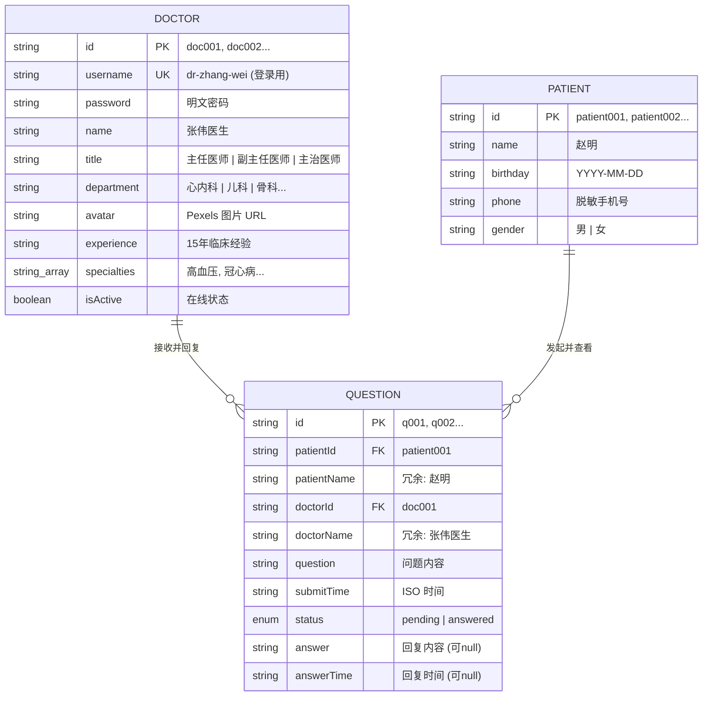
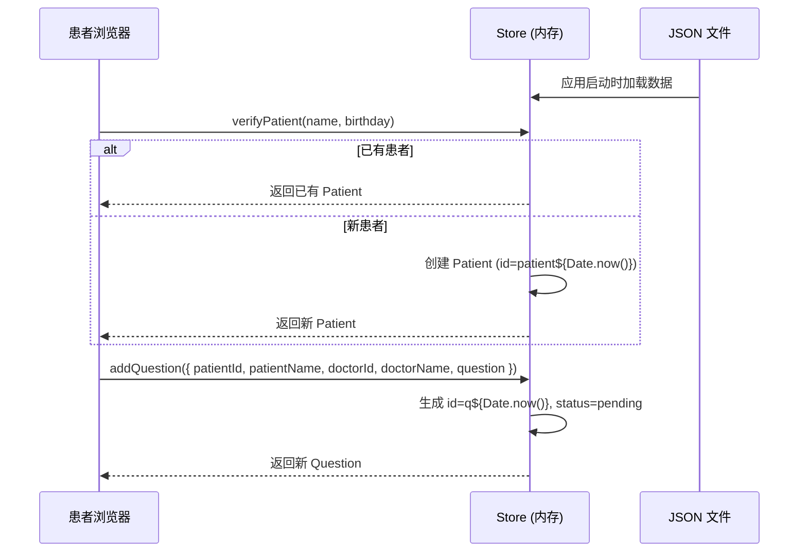
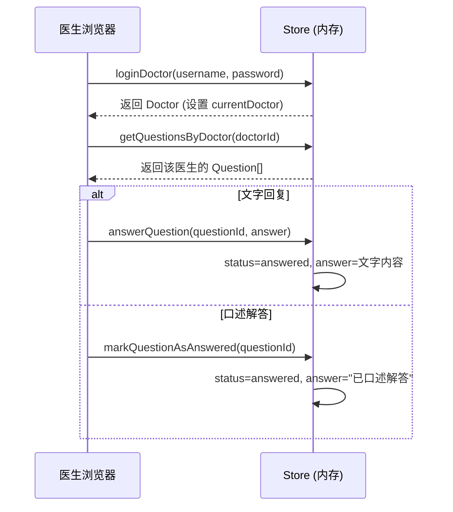
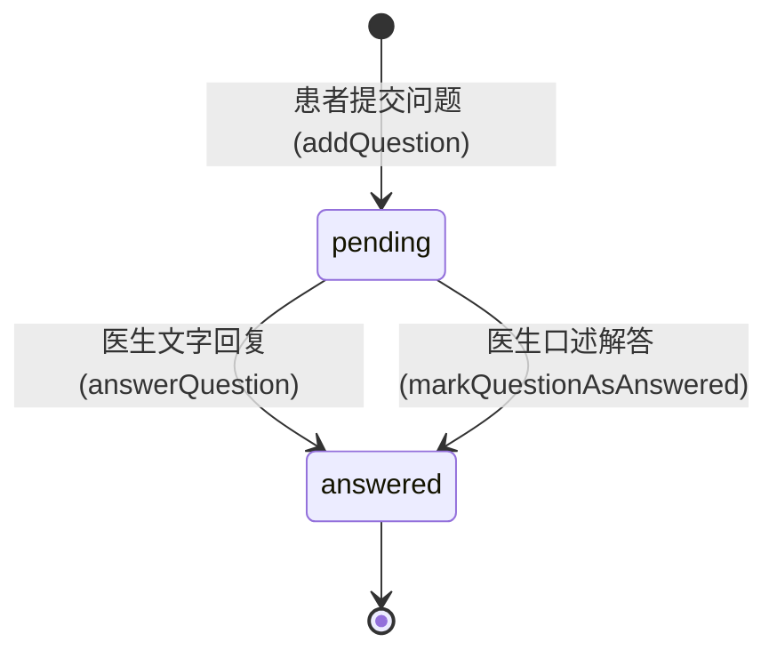

# 数据模型文档

## 概述

QA Live Healthcare 采用客户端内存状态管理，所有数据通过 TypeScript 接口定义，从 JSON 文件初始化加载，运行时存储在 Vue 3 `reactive()` 响应式对象中。**无后端数据库、无持久化、无 API 调用**。

> **定义位置**: 所有接口和状态管理逻辑集中在 `src/store/index.ts`

## 实体关系图



**关系说明**:
- `Doctor` → `Question`: 一对多，一位医生可接收多个问诊问题
- `Patient` → `Question`: 一对多，一位患者可提交多个问诊问题
- `Question` 中冗余存储了 `patientName` 和 `doctorName`，避免列表展示时联表查询

---

## 实体定义

### 1. Doctor（医生）

```typescript
// src/store/index.ts
export interface Doctor {
  id: string;              // 唯一标识，格式 "doc" + 序号
  username: string;        // 登录用户名，格式 "dr-" + 拼音
  password: string;        // 登录密码（明文存储）
  name: string;            // 显示姓名，带"医生"后缀
  title: string;           // 职称
  department: string;      // 所属科室
  avatar: string;          // 头像 URL（Pexels 外链）
  experience: string;      // 从业经验描述
  specialties: string[];   // 专长标签数组
  isActive: boolean;       // 是否在线（控制首页开放诊室展示）
}
```

**title 枚举值**: `主任医师` | `副主任医师` | `主治医师`

**department 枚举值**: `心内科` | `儿科` | `骨科` | `妇产科` | `消化内科`

**实际数据** (`src/data/doctor-user-list.json`):

| ID | 用户名 | 姓名 | 职称 | 科室 | 经验 | 在线 |
|----|--------|------|------|------|------|------|
| doc001 | dr-zhang-wei | 张伟医生 | 主任医师 | 心内科 | 15年临床经验 | true |
| doc002 | dr-li-na | 李娜医生 | 副主任医师 | 儿科 | 10年临床经验 | true |
| doc003 | dr-wang-qiang | 王强医生 | 主治医师 | 骨科 | 8年临床经验 | true |
| doc004 | dr-liu-min | 刘敏医生 | 主任医师 | 妇产科 | 18年临床经验 | false |
| doc005 | dr-chen-jie | 陈杰医生 | 副主任医师 | 消化内科 | 12年临床经验 | true |

> 所有医生密码统一为 `123456`，默认测试账号: `dr-zhang-wei`

### 2. Patient（患者）

```typescript
// src/store/index.ts
export interface Patient {
  id: string;        // 唯一标识，格式 "patient" + 序号 或 "patient" + 时间戳
  name: string;      // 患者姓名
  birthday: string;  // 出生日期，格式 YYYY-MM-DD
  phone: string;     // 联系电话（脱敏格式）
  gender: string;    // 性别: "男" | "女"
}
```

**实际数据** (`src/data/patient-user.json`):

| ID | 姓名 | 生日 | 手机号 | 性别 |
|----|------|------|--------|------|
| patient001 | 赵明 | 1985-03-15 | 138\*\*\*\*1234 | 男 |
| patient002 | 孙丽 | 1990-07-22 | 139\*\*\*\*5678 | 女 |
| patient003 | 周杰 | 1978-11-08 | 137\*\*\*\*9012 | 男 |
| patient004 | 吴芳 | 1995-05-20 | 136\*\*\*\*3456 | 女 |
| patient005 | 郑浩 | 1988-09-12 | 135\*\*\*\*7890 | 男 |

> 新患者通过 `verifyPatient()` 自动创建时，`id` 格式为 `patient${Date.now()}`，`phone` 和 `gender` 为空字符串

### 3. Question（问诊问题）

```typescript
// src/store/index.ts
export interface Question {
  id: string;                     // 唯一标识，格式 "q" + 序号 或 "q" + 时间戳
  patientId: string;              // 患者ID（外键 → Patient.id）
  patientName: string;            // 患者姓名（冗余字段）
  doctorId: string;               // 医生ID（外键 → Doctor.id）
  doctorName: string;             // 医生姓名（冗余字段）
  question: string;               // 问题内容
  submitTime: string;             // 提交时间（ISO 格式）
  status: 'pending' | 'answered'; // 状态枚举
  answer: string | null;          // 医生回复（pending 时为 null）
  answerTime: string | null;      // 回复时间（pending 时为 null）
}
```

**状态枚举**:

| 值 | 含义 | answer | answerTime |
|----|------|--------|------------|
| `pending` | 待回复 | `null` | `null` |
| `answered` | 已回复 | 文字内容 或 `"已口述解答"` | ISO 时间 |

**实际数据** (`src/data/question-list.json`):

| ID | 患者 | 医生 | 问题摘要 | 状态 |
|----|------|------|----------|------|
| q001 | 赵明 | 张伟医生 | 胸闷气短 | answered |
| q002 | 孙丽 | 李娜医生 | 孩子咳嗽 | pending |
| q003 | 周杰 | 王强医生 | 脚踝扭伤 | answered |
| q004 | 赵明 | 张伟医生 | 血压偏高 | pending |
| q005 | 吴芳 | 陈杰医生 | 经常胃痛 | pending |
| q006 | 郑浩 | 张伟医生 | 心律不齐 | pending |
| q007 | 孙丽 | 李娜医生 | 添加辅食 | answered |

---

## 应用状态 (State)

```typescript
// src/store/index.ts
interface State {
  doctors: Doctor[];              // 全部医生列表（从 JSON 初始化）
  patients: Patient[];            // 全部患者列表（从 JSON 初始化，运行时可新增）
  questions: Question[];          // 全部问诊记录（从 JSON 初始化，运行时可新增）
  currentDoctor: Doctor | null;   // 当前登录的医生（登录后设置，登出置 null）
  currentPatient: Patient | null; // 当前验证的患者（验证后设置，登出置 null）
}
```

**状态初始化**:

```typescript
const state = reactive<State>({
  doctors: doctorData as Doctor[],      // 从 doctor-user-list.json 加载
  patients: patientData as Patient[],    // 从 patient-user.json 加载
  questions: questionData as Question[], // 从 question-list.json 加载
  currentDoctor: null,
  currentPatient: null,
});
```

---

## 数据操作 API

所有操作定义在 `src/store/index.ts` 的 `store` 对象中，为同步方法（无 async/await）。

### 医生操作

| 方法 | 签名 | 返回值 | 说明 |
|------|------|--------|------|
| `loginDoctor` | `(username: string, password: string)` | `Doctor \| null` | 按 username+password 匹配，成功设置 `currentDoctor` |
| `logoutDoctor` | `()` | `void` | 置 `currentDoctor = null` |
| `getDoctorByUsername` | `(username: string)` | `Doctor \| undefined` | 按 username 查找医生 |
| `getActiveDoctors` | `()` | `Doctor[]` | 返回 `isActive === true` 的医生列表 |

### 患者操作

| 方法 | 签名 | 返回值 | 说明 |
|------|------|--------|------|
| `verifyPatient` | `(name: string, birthday: string)` | `Patient` | 按姓名+生日查找，不存在则自动创建并 push 到 `patients` 数组 |
| `logoutPatient` | `()` | `void` | 置 `currentPatient = null` |
| `getQuestionsByPatient` | `(patientId: string)` | `Question[]` | 按 patientId 过滤问题列表 |

### 问诊问题操作

| 方法 | 签名 | 返回值 | 说明 |
|------|------|--------|------|
| `getQuestionsByDoctor` | `(doctorId: string)` | `Question[]` | 按 doctorId 过滤问题列表 |
| `addQuestion` | `(data: Omit<Question, 'id'\|'submitTime'\|'status'\|'answer'\|'answerTime'>)` | `Question` | 自动生成 id/时间/状态，push 到 questions 数组 |
| `answerQuestion` | `(questionId: string, answer: string)` | `void` | 设置 status=answered、answer、answerTime |
| `markQuestionAsAnswered` | `(questionId: string)` | `void` | 设置 answer="已口述解答"，与文字回复不同 |

### 统计操作

| 方法 | 签名 | 返回值 | 说明 |
|------|------|--------|------|
| `getStatistics` | `()` | `{ totalDoctors, totalQuestions, activeSessions, totalSessions }` | 首页统计卡片使用 |

**统计字段含义**:

```typescript
{
  totalDoctors: number;    // doctors.length
  totalQuestions: number;  // questions.length
  activeSessions: number;  // questions.filter(q => q.status === 'pending').length（待回复数）
  totalSessions: number;   // doctors.filter(d => d.isActive).length（在线诊室数）
}
```

---

## 数据流

### 患者问诊流程



### 医生回复流程



### 问题状态流转



---

## 数据验证规则

| 操作 | 字段 | 规则 | 实现位置 |
|------|------|------|----------|
| 医生登录 | username | 必填，需与 JSON 数据中的 username 精确匹配 | `store.loginDoctor()` |
| 医生登录 | password | 必填，需与 JSON 数据中的 password 精确匹配（明文比对） | `store.loginDoctor()` |
| 患者验证 | name | 必填，非空字符串 | `Consultation.vue` 表单 + `store.verifyPatient()` |
| 患者验证 | birthday | 必填，需通过 Ant Design DatePicker 选择 | `Consultation.vue` 表单 + `store.verifyPatient()` |
| 患者去重 | name + birthday | 同一组合视为同一患者（`find` 匹配） | `store.verifyPatient()` |
| 提交问题 | doctorId | 必选，通过下拉框选择在线医生 | `Consultation.vue` 弹窗 |
| 提交问题 | question | 必填，非空字符串 | `Consultation.vue` 弹窗 |
| 回复问题 | answer | 文字回复时非空；口述解答时无需输入 | `DoctorRoom.vue` |

> **注意**: 当前无前端表单校验库（如 vee-validate），验证逻辑分散在各组件和 store 方法中。

---

## 数据文件结构

```
src/data/
├── doctor-user-list.json   # 5 位医生（Array<Doctor>）
├── patient-user.json       # 5 位患者（Array<Patient>）
└── question-list.json      # 7 条问诊记录（Array<Question>）
```

这些文件通过 TypeScript 静态 `import` 在 `src/store/index.ts` 中加载，Vite 会将其作为模块内联打包。

---

## 数据局限性

| 局限 | 说明 | 影响 |
|------|------|------|
| **无持久化** | 数据仅存于内存 | 刷新页面后新增数据丢失 |
| **明文密码** | 医生密码未加密 | 安全隐患（仅演示项目） |
| **无认证** | 登录状态无 Token/Session | 刷新即登出 |
| **无分页** | 列表一次性加载全部数据 | 数据量大时性能问题 |
| **无并发控制** | 无乐观锁/悲观锁 | 多标签页可能冲突 |
| **冗余字段** | Question 中冗余存储姓名 | 数据一致性依赖手动维护 |

---

*最后更新: 2026-04-22*
*由 Context Builder 工具集生成*
