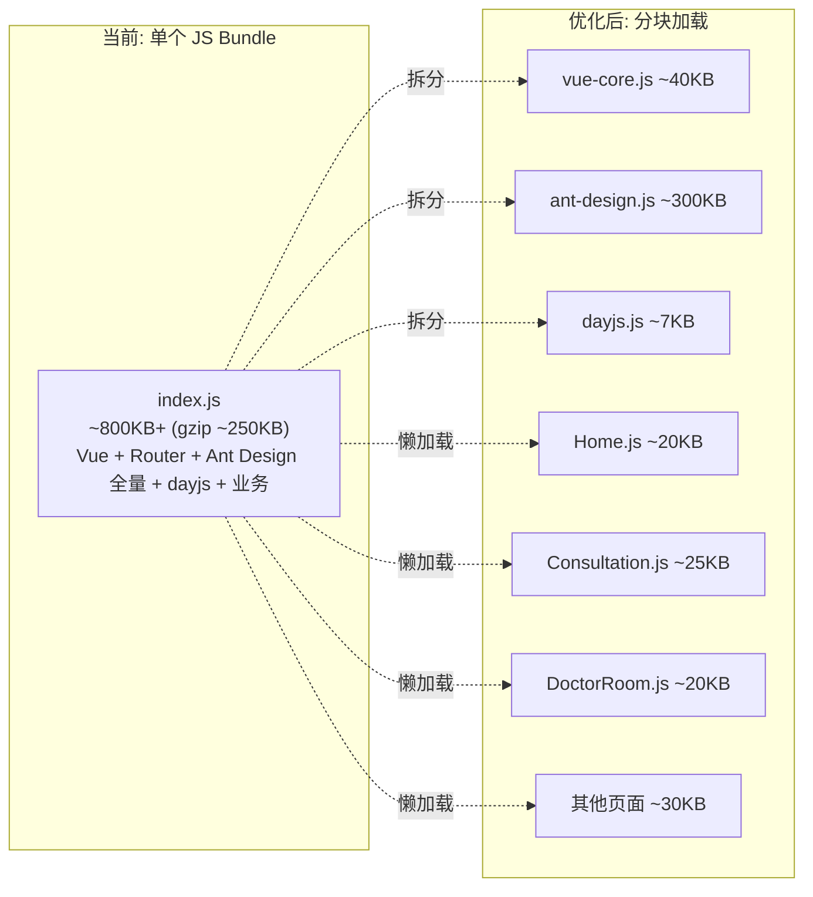
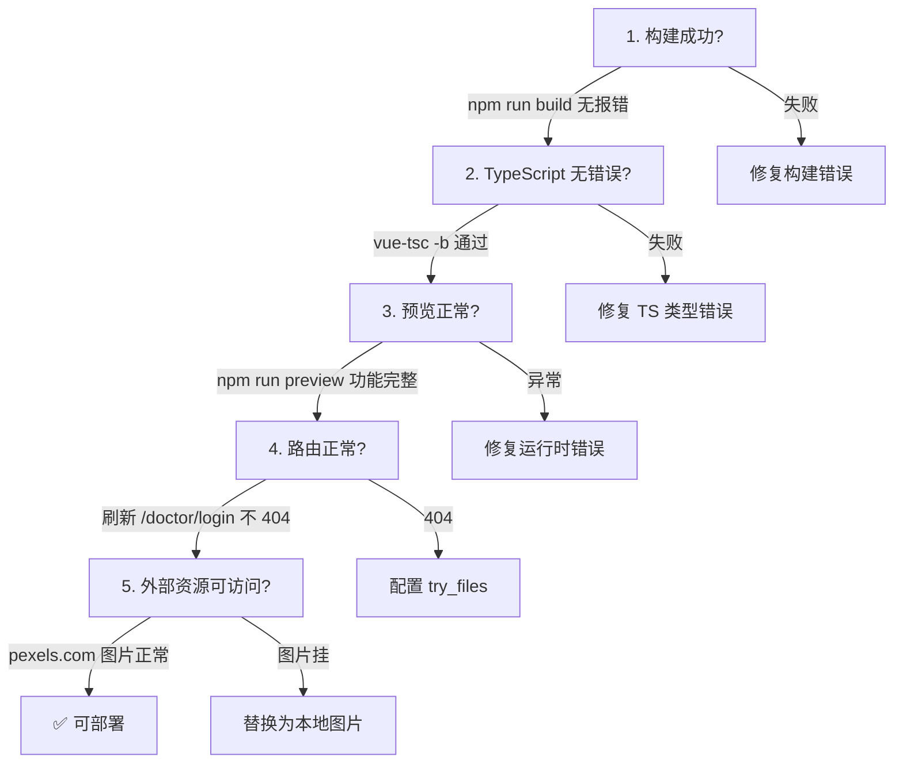

# QA Live Healthcare 部署配置文档

## 1. 当前部署状态

### 1.1 项目部署特征

| 特征 | 状态 | 说明 |
|------|------|------|
| 应用类型 | 纯静态 SPA | Vue 3 单页应用，构建产物为 HTML/CSS/JS |
| 后端服务 | **无** | 所有数据存储在前端内存（reactive + JSON） |
| 数据库 | **无** | 3 个 JSON 文件作为静态数据源 |
| 认证服务 | **无** | 内存中的简单数组匹配 |
| API 代理 | **无** | 无 API 调用 |
| 环境变量 | **无** | 无 `.env` 文件 |
| Docker | **无** | 无 Dockerfile / docker-compose.yml |
| CI/CD | **无** | 无 GitHub Actions / GitLab CI 配置 |
| HTTPS | **无** | 无 SSL 证书配置 |
| 域名 | **无** | 仅 localhost 访问 |

### 1.2 部署架构（当前）

```
┌───────────────────────────────────────────┐
│              浏览器                        │
│                                           │
│   ┌─────────────────────────────────┐     │
│   │  Vue 3 SPA (单文件)             │     │
│   │  包含全部业务逻辑和数据          │     │
│   └─────────────────────────────────┘     │
│                                           │
└───────────────────┬───────────────────────┘
                    │
                    ▼
┌───────────────────────────────────────────┐
│         Vite Dev Server / 静态文件         │
│         (localhost:5173 / dist/)          │
└───────────────────────────────────────────┘
```

> **结论**: 当前项目是一个纯前端原型，部署只需将 `dist/` 目录放到任何静态文件服务器上即可。

---

## 2. 构建配置（实际）

### 2.1 实际配置文件

#### `package.json` — 构建脚本

```json
// package.json:6-9
{
  "scripts": {
    "dev": "vite",
    "build": "vue-tsc -b && vite build",
    "preview": "vite preview"
  }
}
```

#### `vite.config.ts` — 构建配置（极简）

```typescript
// vite.config.ts:1-7 — 当前仅有 Vue 插件
import { defineConfig } from 'vite'
import vue from '@vitejs/plugin-vue'

export default defineConfig({
  plugins: [vue()],
})
```

**当前未配置的项目**:
- ❌ `base` 路径（默认 `/`）
- ❌ `build.outDir` / `build.assetsDir`（默认 `dist/`）
- ❌ `build.minify` / `build.sourcemap`
- ❌ `build.rollupOptions`（代码分割策略）
- ❌ `server.proxy`（API 代理）
- ❌ `resolve.alias`（路径别名）
- ❌ `server.host` / `server.port`

#### `index.html` — 入口文件

```html
<!-- index.html:1-13 -->
<!doctype html>
<html lang="en">
  <head>
    <meta charset="UTF-8" />
    <link rel="icon" type="image/svg+xml" href="/vite.svg" />
    <meta name="viewport" content="width=device-width, initial-scale=1.0" />
    <title>Vite + Vue + TS</title>  <!-- ⚠️ 未改为项目名称 -->
  </head>
  <body>
    <div id="app"></div>
    <script type="module" src="/src/main.ts"></script>
  </body>
</html>
```

**待改进**: `<title>` 仍为默认值 "Vite + Vue + TS"，`lang="en"` 应改为 `zh-CN`。

#### `tsconfig.app.json` — TypeScript 编译配置

```json
// 关键编译选项
{
  "compilerOptions": {
    "target": "ES2020",
    "module": "ESNext",
    "moduleResolution": "bundler",
    "strict": true,
    "noUnusedLocals": true,
    "noUnusedParameters": true,
    "jsx": "preserve",
    "noEmit": true,
    "skipLibCheck": true
  },
  "include": ["src/**/*.ts", "src/**/*.tsx", "src/**/*.vue"]
}
```

### 2.2 依赖清单

| 分类 | 包名 | 版本 | 用途 |
|------|------|------|------|
| 运行时 | vue | ^3.5.10 | UI 框架 |
| 运行时 | vue-router | ^4.6.3 | 路由 |
| 运行时 | ant-design-vue | ^4.2.6 | UI 组件库（**全量导入**） |
| 运行时 | dayjs | ^1.11.19 | 日期格式化 |
| 开发 | vite | ^5.4.8 | 构建工具 |
| 开发 | typescript | ^5.5.3 | 类型系统 |
| 开发 | vue-tsc | ^2.1.6 | Vue TS 类型检查 |
| 开发 | @vitejs/plugin-vue | ^5.1.4 | Vite Vue 插件 |

**缺失的常用依赖**: eslint、prettier、@testing-library/vue、vitest、sass/postcss

### 2.3 构建命令

```bash
# 开发环境（默认端口 5173）
npm run dev

# 生产构建（类型检查 + 打包）
npm run build

# 本地预览构建产物（默认端口 4173）
npm run preview
```

---

## 3. 构建产物分析

### 3.1 产物结构

```
dist/
├── index.html              # SPA 入口
├── vite.svg                # 来自 public/
└── assets/
    ├── index-[hash].css    # 所有组件 scoped 样式 + Ant Design reset.css + style.css
    └── index-[hash].js     # 所有 JS（Vue + Router + Ant Design + dayjs + 业务代码）
```

### 3.2 产物特征

| 特征 | 状态 | 原因 |
|------|------|------|
| 代码分割 | ❌ | 未配置 `rollupOptions.manualChunks` |
| Tree Shaking | ❌ | Ant Design 全量导入（`main.ts:2`） |
| CSS 提取 | ✅ | Vite 默认行为 |
| 资源哈希 | ✅ | Vite 默认 `[hash]` |
| sourcemap | ❌ | 未配置 |
| 压缩 | ✅ | Vite 默认 esbuild minify |
| 路由懒加载 | ❌ | 所有视图组件静态 import（`router/index.ts:2-7`） |

### 3.3 预估产物体积问题



---

## 4. 开发环境部署

### 4.1 环境要求

| 要求 | 最低版本 | 推荐版本 |
|------|---------|---------|
| Node.js | 18.0+ | 20.x LTS |
| npm | 9.0+ | 10.x |
| 操作系统 | Windows 10 / macOS / Ubuntu 18.04 | Windows 11 / macOS 14 / Ubuntu 22.04 |
| 磁盘空间 | 500MB | 1GB |

### 4.2 本地开发步骤

```bash
# 1. 克隆项目
git clone <repo-url>
cd qa-live-healthcare-interview

# 2. 安装依赖
npm install

# 3. 启动开发服务器
npm run dev

# 4. 浏览器访问
# http://localhost:5173/
```

### 4.3 开发服务器配置（默认）

| 参数 | 默认值 | 位置 |
|------|--------|------|
| 端口 | 5173 | Vite 内置 |
| Host | localhost | Vite 内置 |
| 热更新 | 开启 | Vite 内置 |
| HTTPS | 关闭 | Vite 内置 |
| 代理 | 无 | 未配置 |
| 打开浏览器 | 关闭 | Vite 内置 |

---

## 5. 静态部署方案

### 5.1 方案对比

| 方案 | 难度 | 成本 | 适用场景 | History 路由支持 |
|------|------|------|---------|---------------|
| Nginx | ★★☆ | 服务器费用 | 自有服务器 | ✅ 需配置 |
| Vercel | ★☆☆ | 免费 | 个人/开源项目 | ✅ 自动 |
| Netlify | ★☆☆ | 免费 | 个人/开源项目 | ✅ 自动 |
| 腾讯云 COS + CDN | ★★☆ | 低 | 国内用户 | ⚠️ 需配置 |
| GitHub Pages | ★☆☆ | 免费 | 开源演示 | ❌ 仅 Hash 模式 |
| Docker + Nginx | ★★★ | 服务器费用 | 容器化部署 | ✅ 需配置 |

### 5.2 路由模式注意事项

本项目使用 `createWebHistory()`（HTML5 History API），部署时**必须**配置服务器将所有路由指向 `index.html`：

```
用户访问 /doctor/login
    ↓
服务器查找 /doctor/login 文件 → 404
    ↓
正确: 服务器返回 index.html → Vue Router 接管 → 渲染 DoctorLogin 组件
```

### 5.3 方案一：Nginx 部署（推荐用于生产）

```nginx
# /etc/nginx/conf.d/qa-live-healthcare.conf

server {
    listen 80;
    server_name your-domain.com;

    root /var/www/qa-live-healthcare/dist;
    index index.html;

    # Gzip 压缩
    gzip on;
    gzip_types text/plain text/css application/json application/javascript text/xml;
    gzip_min_length 1000;

    # 静态资源长期缓存（Vite 默认带 hash）
    location /assets/ {
        expires 1y;
        add_header Cache-Control "public, immutable";
    }

    # HTML 不缓存
    location ~* \.html$ {
        expires -1;
        add_header Cache-Control "no-cache, no-store";
    }

    # Vue Router History 模式 — 核心
    location / {
        try_files $uri $uri/ /index.html;
    }
}
```

```bash
# 部署步骤
npm run build
scp -r dist/* user@server:/var/www/qa-live-healthcare/dist/
ssh user@server "nginx -s reload"
```

### 5.4 方案二：Vercel 部署（零配置）

```bash
# 1. 安装 Vercel CLI
npm i -g vercel

# 2. 部署
vercel

# 3. 生产部署
vercel --prod
```

Vercel 自动识别 Vue + Vite 项目，无需额外配置即可支持 History 路由。

### 5.5 方案三：Netlify 部署

创建 `netlify.toml`：

```toml
[build]
  command = "npm run build"
  publish = "dist"

[[redirects]]
  from = "/*"
  to = "/index.html"
  status = 200
```

### 5.6 方案四：Docker 部署

创建 `Dockerfile`（项目当前不存在）：

```dockerfile
# 构建阶段
FROM node:20-alpine AS builder
WORKDIR /app
COPY package*.json ./
RUN npm ci
COPY . .
RUN npm run build

# 运行阶段
FROM nginx:alpine
COPY --from=builder /app/dist /usr/share/nginx/html
COPY nginx.conf /etc/nginx/conf.d/default.conf
EXPOSE 80
CMD ["nginx", "-g", "daemon off;"]
```

配套 `nginx.conf`：

```nginx
server {
    listen 80;
    root /usr/share/nginx/html;
    index index.html;

    location /assets/ {
        expires 1y;
        add_header Cache-Control "public, immutable";
    }

    location / {
        try_files $uri $uri/ /index.html;
    }
}
```

```bash
docker build -t qa-live-healthcare .
docker run -d -p 80:80 qa-live-healthcare
```

---

## 6. 构建优化建议

### 6.1 当前 → 目标对比

| 优化项 | 当前 | 目标 | 预期效果 |
|--------|------|------|---------|
| Ant Design 导入 | 全量 `import Antd` | 按需 `unplugin-vue-components` | JS 体积减少 ~40% |
| 路由加载 | 静态 import 6 个视图 | `() => import()` 懒加载 | 首屏 JS 减少 ~30% |
| 代码分割 | 单 bundle | `manualChunks` 分 3-4 块 | 缓存命中率提升 |
| CSS 处理 | scoped 各组件 | CSS 变量 + 设计令牌 | 可维护性提升 |
| 图片资源 | 外部 pexels.com URL | 本地 / CDN | 无第三方依赖 |
| HTML title | "Vite + Vue + TS" | "QA Live Healthcare - 在线问诊" | SEO + 用户体验 |

### 6.2 推荐的 `vite.config.ts` 优化版

```typescript
// vite.config.ts — 建议升级版本
import { defineConfig } from 'vite'
import vue from '@vitejs/plugin-vue'
import Components from 'unplugin-vue-components/vite'
import { AntDesignVueResolver } from 'unplugin-vue-components/resolvers'

export default defineConfig({
  plugins: [
    vue(),
    Components({
      resolvers: [AntDesignVueResolver()],
    }),
  ],

  build: {
    rollupOptions: {
      output: {
        manualChunks: {
          'vue-vendor': ['vue', 'vue-router'],
          'antd-vendor': ['ant-design-vue'],
          'utils': ['dayjs'],
        },
      },
    },
    chunkSizeWarningLimit: 500,
  },

  server: {
    port: 5173,
    open: true,
  },
})
```

### 6.3 推荐的路由懒加载改造

```typescript
// router/index.ts — 将静态 import 改为动态 import
// 当前 (router/index.ts:2-7):
import Home from '../views/Home.vue';
import Consultation from '../views/Consultation.vue';
// ... 全部静态导入

// 建议改为:
const routes: RouteRecordRaw[] = [
  { path: '/', name: 'Home', component: () => import('../views/Home.vue') },
  { path: '/consultation', name: 'Consultation', component: () => import('../views/Consultation.vue') },
  { path: '/consultation/:doctorUsername', name: 'ConsultationRoom', component: () => import('../views/Consultation.vue') },
  { path: '/doctors', name: 'Doctors', component: () => import('../views/Doctors.vue') },
  { path: '/doctor/login', name: 'DoctorLogin', component: () => import('../views/DoctorLogin.vue') },
  { path: '/doctor/room/:username', name: 'DoctorRoom', component: () => import('../views/DoctorRoom.vue') },
  { path: '/about', name: 'About', component: () => import('../views/About.vue') },
]
```

---

## 7. 部署检查清单

### 7.1 部署前检查



### 7.2 当前已知部署问题

| # | 问题 | 位置 | 影响 | 修复建议 |
|---|------|------|------|---------|
| 1 | 外部图片依赖 pexels.com | `AppHeader.vue:5`, `Home.vue:31` | CDN 不可用时图片丢失 | 下载到 `public/images/` |
| 2 | HTML title 未改 | `index.html:7` | 浏览器标签显示错误 | 改为 "QA Live Healthcare" |
| 3 | `lang="en"` | `index.html:2` | SEO 和屏幕阅读器 | 改为 `zh-CN` |
| 4 | favicon 仍为 Vite 默认 | `index.html:5`, `public/vite.svg` | 不专业 | 替换为项目图标 |
| 5 | 无 `.gitignore` 中的 `dist/` | — | 构建产物可能被提交 | 确保 `.gitignore` 包含 `dist/` |

---

## 8. 未来部署架构（接入后端后）

当项目接入后端 API 后，部署架构将变为：

```
┌──────────────────────────────────────────────────────────┐
│                        用户浏览器                         │
└──────────────────────┬───────────────────────────────────┘
                       │
                       ▼
┌──────────────────────────────────────────────────────────┐
│                    CDN / Nginx                            │
│         静态资源: dist/ (HTML/CSS/JS/图片)                │
│         API 代理:  /api/* → 后端服务                      │
└──────────┬────────────────────────┬─────────────────────┘
           │                        │
           ▼                        ▼
┌──────────────────┐    ┌──────────────────┐
│   前端 SPA        │    │   后端 API        │
│   (Nginx 托管)    │    │   (Node.js/Java)  │
│   Vue 3 构建      │    │   REST + JWT      │
└──────────────────┘    └────────┬─────────┘
                                 │
                        ┌────────┴────────┐
                        ▼                 ▼
                 ┌────────────┐   ┌────────────┐
                 │ PostgreSQL │   │   Redis    │
                 │  主数据库    │   │  缓存/会话  │
                 └────────────┘   └────────────┘
```

届时需要新增：
- 后端服务部署（Docker + PM2）
- 数据库部署与迁移
- 环境变量管理（`.env.*` 文件）
- API 代理配置（Nginx `proxy_pass`）
- SSL/HTTPS 证书
- CI/CD 流水线
- 健康检查端点

---

## 9. 快速参考

### 9.1 常用命令

| 命令 | 用途 |
|------|------|
| `npm install` | 安装依赖 |
| `npm run dev` | 启动开发服务器 (localhost:5173) |
| `npm run build` | 生产构建 → `dist/` |
| `npm run preview` | 预览构建产物 (localhost:4173) |

### 9.2 关键端口

| 服务 | 端口 | 说明 |
|------|------|------|
| Vite Dev Server | 5173 | 开发环境 |
| Vite Preview | 4173 | 构建预览 |
| Nginx (生产) | 80 | HTTP |
| Nginx (生产) | 443 | HTTPS (待配置) |

### 9.3 配置文件索引

| 文件 | 用途 | 行数 |
|------|------|------|
| `vite.config.ts` | Vite 构建配置 | 7 |
| `tsconfig.app.json` | TS 编译选项 | ~25 |
| `tsconfig.json` | TS 项目引用 | ~6 |
| `tsconfig.node.json` | Node TS 配置 | ~10 |
| `package.json` | 依赖与脚本 | 23 |
| `index.html` | SPA 入口 | 13 |

---

## 10. 文档关联

| 文档 | 描述 | 关联 |
|------|------|------|
| [index.md](./index.md) | 项目概览 | 入口 |
| [architecture.md](./architecture.md) | 系统架构 | §9 部署架构 |
| [standard-project-structure.md](./standard-project-structure.md) | 目录结构 | 配置文件位置 |
| [api.md](./api.md) | API 文档 | 后端 API 部署参考 |

---

*文档版本：2.0.0（基于实际代码重新生成）*
*最后更新：2026-04-22*
*分析方法：全量配置文件审计*
