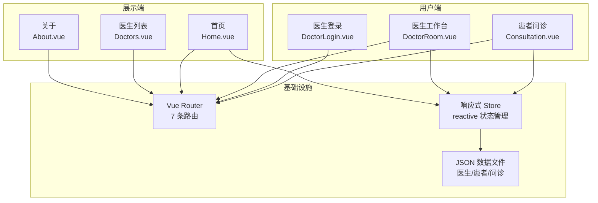
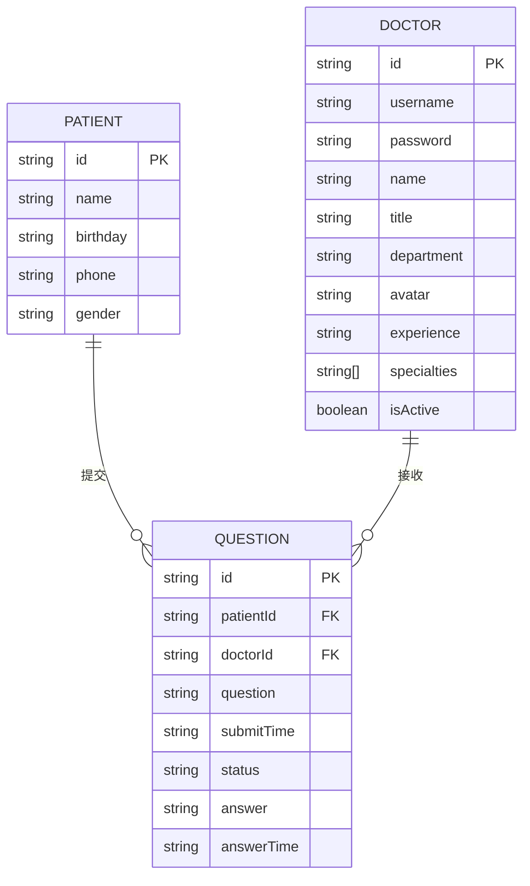

# QA Live Healthcare - 在线问诊平台

## 项目概述

**QA Live Healthcare** 是一个基于 Vue 3 + TypeScript + Vite 构建的在线医疗问诊平台。当前为**纯前端单页应用 (SPA)**，所有数据存储在客户端内存中（从 JSON 文件加载），无后端服务依赖。

### 核心信息

| 项目 | 详情 |
|------|------|
| **项目名称** | QA Live Healthcare |
| **项目类型** | 纯前端 SPA（无后端） |
| **前端框架** | Vue 3.5.10 (Composition API / `<script setup>`) |
| **开发语言** | TypeScript 5.5.3 (strict 模式) |
| **构建工具** | Vite 5.4.8 |
| **UI 组件库** | Ant Design Vue 4.2.6（全量引入） |
| **路由** | Vue Router 4.6.3 (HTML5 History 模式) |
| **状态管理** | Vue 3 `reactive()`（轻量级，未使用 Pinia/Vuex） |
| **日期处理** | Day.js 1.11.19 |
| **包管理器** | npm |
| **国际化** | 无（界面全为简体中文硬编码） |

## 系统架构概览



## 页面路由

| 路径 | 组件 | 说明 |
|------|------|------|
| `/` | `Home.vue` | 首页 - 统计卡片 + 开放诊室 |
| `/consultation` | `Consultation.vue` | 患者问诊（通用入口） |
| `/consultation/:doctorUsername` | `Consultation.vue` | 指定医生的问诊室 |
| `/doctors` | `Doctors.vue` | 医生团队列表（含在线状态） |
| `/about` | `About.vue` | 关于平台 |
| `/doctor/login` | `DoctorLogin.vue` | 医生登录 |
| `/doctor/room/:username` | `DoctorRoom.vue` | 医生工作台（回答问题） |

## 数据模型概览



**数据规模**: 5 位医生 / 5 位患者 / 7 条问诊记录（3 已回答 + 4 待回复）

**测试账号**: 所有医生密码为 `123456`，默认测试账号 `dr-zhang-wei`

## 项目结构

```
qa-live-healthcare/
├── src/
│   ├── components/          # 公共组件
│   │   ├── AppHeader.vue    # 全局顶部导航栏（固定 64px）
│   │   ├── AppFooter.vue    # 全局底部
│   │   └── HelloWorld.vue   # 脚手架示例（未使用）
│   ├── views/               # 页面视图
│   │   ├── Home.vue         # 首页（统计 + 开放诊室）
│   │   ├── Consultation.vue # 患者问诊（~480 行，最大组件）
│   │   ├── DoctorLogin.vue  # 医生登录
│   │   ├── DoctorRoom.vue   # 医生工作台
│   │   ├── Doctors.vue      # 医生列表
│   │   └── About.vue        # 关于我们
│   ├── data/                # JSON 数据文件
│   │   ├── doctor-user-list.json
│   │   ├── patient-user.json
│   │   └── question-list.json
│   ├── store/
│   │   └── index.ts         # 响应式状态管理（接口定义 + 业务逻辑）
│   ├── router/
│   │   └── index.ts         # 路由配置（7 条路由，静态导入）
│   ├── App.vue              # 根组件（Ant Design Layout）
│   ├── main.ts              # 应用入口（注册 Antd + Router）
│   └── style.css            # 全局样式重置
├── server/
│   └── qa-service-user/     # 空目录（后端占位）
├── .asdm/
│   ├── contexts/            # Context Builder 上下文文件
│   └── toolsets/            # ASDM 工具集
├── index.html
├── package.json
├── vite.config.ts           # 最小化配置（仅 vue 插件）
└── tsconfig*.json
```

## 关键设计决策与注意事项

| 项目 | 说明 |
|------|------|
| **数据持久化** | 无。刷新页面后所有状态丢失，数据仅存于内存 |
| **路由懒加载** | 未使用。所有组件为静态 `import` |
| **路由守卫** | 无。医生工作台权限检查仅在组件 `onMounted` 中 |
| **Ant Design 引入** | 全量注册 `app.use(Antd)`，未做按需引入优化 |
| **外部依赖** | 大量使用 Pexels 外链图片作为头像，依赖外部网络 |
| **重复代码** | `formatTime` 函数在 `Consultation.vue` 和 `DoctorRoom.vue` 中重复定义 |
| **未使用组件** | `HelloWorld.vue` 为 Vite 脚手架默认组件，未被引用 |
| **后端服务** | `server/qa-service-user/` 为空目录，后端尚未实现 |

## 上下文文件索引

以下上下文文档按需查看，由 Context Builder 工具集生成：

| 文件 | 内容说明 |
|------|----------|
| [standard-project-structure.md](standard-project-structure.md) | 目录结构、组件规范、配置文件说明 |
| [standard-coding-style.md](standard-coding-style.md) | Vue 组件、TypeScript、CSS 编码规范 |
| [data-models.md](data-models.md) | 数据模型定义、ER 图、状态结构、验证规则 |
| [api.md](api.md) | 未来后端 API 设计规范（认证、医生、患者、问题、统计接口） |
| [architecture.md](architecture.md) | 系统架构、模块设计、数据流、组件层级、性能优化 |
| [deployment.md](deployment.md) | 部署方案（Nginx、Docker、CI/CD、云平台、监控） |

### 推荐阅读顺序

1. 新开发者入门 → [standard-project-structure.md](standard-project-structure.md)
2. 编写代码前 → [standard-coding-style.md](standard-coding-style.md)
3. 业务功能开发 → [data-models.md](data-models.md) → [api.md](api.md)
4. 架构理解 → [architecture.md](architecture.md)
5. 部署上线 → [deployment.md](deployment.md)

## 构建命令

```bash
npm run dev      # 启动开发服务器（默认端口 5173）
npm run build    # 生产构建（输出到 dist/）
npm run preview  # 预览生产构建
npm run type-check  # TypeScript 类型检查
```

---

*最后更新: 2026-04-22*
*由 Context Builder 工具集生成*
