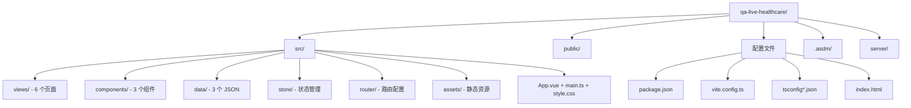

# 标准项目结构文档

## 概述

QA Live Healthcare 是一个基于 Vite + Vue 3 + TypeScript 脚手架模板生成的纯前端 SPA 项目。结构遵循 Vite 官方推荐的目录布局，按**功能类型**（views / components / data / store / router）组织代码。



---

## 完整目录结构

```
qa-live-healthcare/
│
├── src/                              # 源代码（TypeScript + Vue SFC）
│   ├── views/                        # 页面视图组件（路由级）
│   │   ├── Home.vue                  #   首页（统计卡片 + 开放诊室）
│   │   ├── Consultation.vue          #   患者问诊（两阶段 UI，~480 行）
│   │   ├── DoctorLogin.vue           #   医生登录
│   │   ├── DoctorRoom.vue            #   医生工作台（回答问题）
│   │   ├── Doctors.vue               #   医生列表
│   │   └── About.vue                 #   关于平台
│   │
│   ├── components/                   # 公共组件（跨页面复用）
│   │   ├── AppHeader.vue             #   全局顶部导航栏（固定 64px）
│   │   ├── AppFooter.vue             #   全局底部
│   │   └── HelloWorld.vue            #   脚手架示例（未使用，可删除）
│   │
│   ├── data/                         # 静态 JSON 数据（应用初始数据源）
│   │   ├── doctor-user-list.json     #   5 位医生数据
│   │   ├── patient-user.json         #   5 位患者数据
│   │   └── question-list.json        #   7 条问诊记录
│   │
│   ├── store/
│   │   └── index.ts                  # 响应式状态管理（接口定义 + 业务逻辑）
│   │
│   ├── router/
│   │   └── index.ts                  # 路由配置（7 条路由，静态导入）
│   │
│   ├── assets/
│   │   └── vue.svg                   # Vue Logo（未使用）
│   │
│   ├── App.vue                       # 根组件（Ant Design Layout 壳）
│   ├── main.ts                       # 应用入口（注册 Antd + Router）
│   ├── style.css                     # 全局样式重置
│   └── vite-env.d.ts                 # Vite 类型声明（/// <reference>）
│
├── public/                           # 静态资源（不经 Vite 处理，直接复制）
│   └── vite.svg                      # Vite 图标
│
├── server/                           # 后端服务（预留，当前为空）
│   └── qa-service-user/              #   用户服务目录（空）
│
├── .asdm/                            # ASDM 配置与工具集
│   ├── contexts/                     # Context Builder 上下文文件
│   └── toolsets/                     # 已安装的工具集
│
├── .bolt/                            # Bolt 配置
│   └── config.json                   #   模板标识: vite-vue-ts
│
├── .codebuddy/                       # CodeBuddy 配置
│   └── commands/                     # 自定义命令
│
├── .env                              # 环境变量（空文件）
├── .gitignore                        # Git 忽略规则
├── index.html                        # HTML 入口（Vite 挂载点）
├── package.json                      # 项目依赖与脚本
├── package-lock.json                 # 依赖版本锁定
├── vite.config.ts                    # Vite 构建配置
├── tsconfig.json                     # TypeScript 基础配置
├── tsconfig.app.json                 # TypeScript 应用配置（strict 模式）
├── tsconfig.node.json                # TypeScript Node 配置
└── README.md                         # 项目说明（脚手架默认内容）
```

---

## 核心目录详解

### src/views/ — 页面视图

每个 `.vue` 文件对应一个路由页面，是应用的功能主体。

| 文件 | 路由 | 行数 | 职责 | 使用的主要 Ant Design 组件 |
|------|------|------|------|--------------------------|
| `Home.vue` | `/` | ~200 | 首页：Hero 区 + 统计卡片 + 开放诊室网格 | Card, Row, Col, Badge, Button, Tag |
| `Consultation.vue` | `/consultation[/:doctorUsername]` | ~480 | 患者问诊：身份验证 → 问题列表 → 提交弹窗 | Form, Input, DatePicker, Select, Modal, Textarea, Card, Tag, Empty, Timeline |
| `DoctorLogin.vue` | `/doctor/login` | ~80 | 医生登录表单 | Form, Input, Button, Alert |
| `DoctorRoom.vue` | `/doctor/room/:username` | ~250 | 医生工作台：待回复列表 + 已解答折叠 | Card, Button, Textarea, Badge, Collapse, Tag, Empty, Alert, message |
| `Doctors.vue` | `/doctors` | ~90 | 医生团队展示（含在线状态标识） | Card, Row, Col, Badge, Tag |
| `About.vue` | `/about` | ~160 | 平台介绍（4 特色卡片 + 4 服务流程步骤） | Card, Row, Col, Steps |

> `Consultation.vue` 是最大的组件（~480 行），同时承载了患者验证和问诊功能，未来可考虑拆分。

### src/components/ — 公共组件

跨页面复用的 UI 组件。

| 文件 | 被引用位置 | 职责 |
|------|-----------|------|
| `AppHeader.vue` | `App.vue` | 全局顶部导航：Logo + 菜单项（首页/医生/关于）+ 登录状态检测 |
| `AppFooter.vue` | `App.vue` | 全局底部：版权信息 |
| `HelloWorld.vue` | **无** | Vite 脚手架默认示例，未被任何文件引用 |

### src/data/ — 静态数据

通过 TypeScript `import` 在 `store/index.ts` 中加载，Vite 打包时内联。

| 文件 | 类型 | 记录数 | 关键字段 |
|------|------|--------|----------|
| `doctor-user-list.json` | `Doctor[]` | 5 | id, username, name, title, department, isActive |
| `patient-user.json` | `Patient[]` | 5 | id, name, birthday, phone, gender |
| `question-list.json` | `Question[]` | 7 | id, patientId, doctorId, question, status |

### src/store/ — 状态管理

单文件 `index.ts`，承担以下职责：

| 职责 | 内容 |
|------|------|
| **接口定义** | `Doctor`, `Patient`, `Question`, `State` |
| **状态初始化** | `reactive<State>({...})`，从 JSON 文件加载数据 |
| **业务方法** | `loginDoctor`, `verifyPatient`, `addQuestion`, `answerQuestion` 等 11 个方法 |
| **导出** | `export const store` 供组件直接调用 |

**使用方式**:
```typescript
import { store } from '../store';

// 读取状态
const doctors = store.state.doctors;

// 调用方法（同步，无 async）
const doctor = store.loginDoctor('dr-zhang-wei', '123456');
```

### src/router/ — 路由配置

单文件 `index.ts`，7 条路由定义。

```mermaid
graph LR
    subgraph 公开页面
        A[/ → Home]
        B[/doctors → Doctors]
        C[/about → About]
        D[/consultation → Consultation]
        E[/consultation/:doctorUsername → Consultation]
    end

    subgraph 医生页面
        F[/doctor/login → DoctorLogin]
        G[/doctor/room/:username → DoctorRoom]
    end
```

**特点**:
- 所有组件为**静态 `import`**，未使用路由懒加载
- **无路由守卫**（无 `beforeEach` 等），权限检查在组件 `onMounted` 中完成
- **无路由 meta 信息**（无 title、权限标记等）

---

## 配置文件说明

### package.json

| 字段 | 值 | 说明 |
|------|-----|------|
| `name` | `vite-vue-typescript-starter` | 脚手架默认名称 |
| `type` | `module` | ES Modules 模式 |
| `private` | `true` | 不发布到 npm |

**脚本**:

| 命令 | 实现 | 说明 |
|------|------|------|
| `npm run dev` | `vite` | 启动开发服务器（默认端口 5173，支持 HMR） |
| `npm run build` | `vue-tsc -b && vite build` | 先类型检查再构建（输出到 `dist/`） |
| `npm run preview` | `vite preview` | 本地预览生产构建结果 |

**依赖**:

| 包 | 版本 | 类型 | 说明 |
|----|------|------|------|
| `vue` | ^3.5.10 | runtime | Vue 3 核心 |
| `vue-router` | ^4.6.3 | runtime | 路由管理 |
| `ant-design-vue` | ^4.2.6 | runtime | UI 组件库（全量引入） |
| `dayjs` | ^1.11.19 | runtime | 日期格式化 |
| `@vitejs/plugin-vue` | ^5.1.4 | dev | Vite 的 Vue SFC 编译插件 |
| `typescript` | ^5.5.3 | dev | TypeScript 编译器 |
| `vite` | ^5.4.8 | dev | 构建工具 |
| `vue-tsc` | ^2.1.6 | dev | Vue 文件的 TypeScript 类型检查 |

> **注意**: `@ant-design/icons-vue` 未在 `package.json` 中显式声明，它是 `ant-design-vue` 的传递依赖，但被多个组件直接 import。

### vite.config.ts

最小化配置，仅注册 Vue 插件：

```typescript
import { defineConfig } from 'vite'
import vue from '@vitejs/plugin-vue'

export default defineConfig({
  plugins: [vue()],
})
```

**未配置项**（可按需添加）:
- 路径别名（如 `@/` → `src/`）
- 开发代理（API 请求转发）
- 构建优化（分包、chunk 拆分）
- CSS 预处理器（Sass/Less）
- 环境变量前缀

### TypeScript 配置

| 文件 | 用途 |
|------|------|
| `tsconfig.json` | 入口配置，引用 `tsconfig.app.json` 和 `tsconfig.node.json` |
| `tsconfig.app.json` | 应用代码配置：`strict: true`，目标 `ES2020`，模块 `ESNext`，`noUnusedLocals/Parameters` |
| `tsconfig.node.json` | Vite 配置文件（`vite.config.ts`）的 TypeScript 配置 |

**关键编译选项** (`tsconfig.app.json`):

| 选项 | 值 | 影响 |
|------|-----|------|
| `strict` | `true` | 启用所有严格类型检查 |
| `noUnusedLocals` | `true` | 禁止未使用的局部变量 |
| `noUnusedParameters` | `true` | 禁止未使用的函数参数 |
| `noFallthroughCasesInSwitch` | `true` | switch 语句必须有 break |
| `moduleResolution` | `bundler` | 匹配 Vite 的模块解析策略 |
| `noEmit` | `true` | 仅做类型检查，不输出文件（由 Vite 负责） |

### index.html

```html
<!DOCTYPE html>
<html lang="zh-CN">
  <head>
    <meta charset="UTF-8" />
    <link rel="icon" type="image/svg+xml" href="/vite.svg" />
    <meta name="viewport" content="width=device-width, initial-scale=1.0" />
    <title>QA Live Healthcare</title>
  </head>
  <body>
    <div id="app"></div>
    <script type="module" src="/src/main.ts"></script>
  </body>
</html>
```

---

## 组件开发规范

### Vue SFC 结构顺序

项目统一使用 `<script setup lang="ts">`，组件结构固定为：

```
1. <script setup lang="ts">   — 逻辑层
2. <template>                  — 模板层
3. <style scoped>              — 样式层
```

### 组件内部代码组织

```typescript
<script setup lang="ts">
// 1. Vue 核心
import { ref, reactive, computed, watch, onMounted } from 'vue';

// 2. Vue Router
import { useRouter, useRoute } from 'vue-router';

// 3. UI 库
import { message } from 'ant-design-vue';

// 4. 第三方库
import dayjs from 'dayjs';

// 5. 图标
import { CheckCircleOutlined } from '@ant-design/icons-vue';

// 6. 项目内部
import { store } from '../store';

// 7. 响应式数据
const loading = ref(false);

// 8. 计算属性
const filteredList = computed(() => ...);

// 9. 方法
const handleSubmit = () => { ... };

// 10. 生命周期
onMounted(() => { ... });
</script>
```

### 文件命名约定

| 类型 | 命名风格 | 示例 |
|------|----------|------|
| Vue 组件/页面 | PascalCase | `AppHeader.vue`, `DoctorRoom.vue` |
| TypeScript 文件 | camelCase | `main.ts`, `index.ts` |
| CSS 类名 | kebab-case | `app-header`, `doctor-room` |
| JSON 数据文件 | kebab-case | `doctor-user-list.json` |
| 路由路径 | kebab-case | `/doctor/login`, `/doctor/room/:username` |
| 响应式变量 | camelCase | `currentPatient`, `submitModalVisible` |
| 事件处理函数 | handle / 动词开头 | `handleSubmit`, `verifyPatient` |
| TypeScript 接口 | PascalCase（无 I 前缀） | `Doctor`, `Patient`, `Question` |

---

## 开发工作流

### 新增页面

1. 在 `src/views/` 创建 `XxxPage.vue`（使用 `<script setup lang="ts">`）
2. 在 `src/router/index.ts` 添加路由配置并**静态 import**
3. 在 `src/components/AppHeader.vue` 的菜单中添加导航项（如需要）
4. 如需新数据模型，在 `src/store/index.ts` 定义接口
5. 如需初始数据，在 `src/data/` 创建对应 JSON 文件

### 新增公共组件

1. 在 `src/components/` 创建 `XxxComponent.vue`
2. 遵循 SFC 三段式结构 + 代码组织顺序
3. 在使用方 `import XxxComponent from '../components/XxxComponent.vue'`

### 新增数据操作

1. 在 `src/store/index.ts` 的 `State` 接口中添加字段
2. 在 `state` 初始化中赋初值
3. 在 `store` 对象中添加业务方法
4. 在组件中通过 `store.xxx()` 调用

---

## 目录规模统计

| 目录 | 文件数 | 说明 |
|------|--------|------|
| `src/views/` | 6 | 页面视图 |
| `src/components/` | 3 | 公共组件（1 个未使用） |
| `src/data/` | 3 | JSON 数据 |
| `src/store/` | 1 | 状态管理 |
| `src/router/` | 1 | 路由配置 |
| `src/` (根级) | 4 | App.vue, main.ts, style.css, vite-env.d.ts |
| `src/assets/` | 1 | 静态资源（未使用） |
| **src/ 合计** | **19** | — |

---

## 扩展建议

当项目规模增长时，建议新增以下目录：

| 目录 | 用途 | 触发时机 |
|------|------|----------|
| `src/api/` | HTTP 请求封装（axios 实例、拦截器） | 对接后端 API 时 |
| `src/utils/` | 工具函数（如提取重复的 `formatTime`） | 重复代码出现时 |
| `src/types/` | 独立类型定义文件 | 接口数量增多时 |
| `src/hooks/` | 组合式函数（Composables） | 逻辑复用需求增多时 |
| `src/constants/` | 常量定义（路由名、状态枚举等） | 硬编码字符串增多时 |
| `src/styles/` | 全局样式变量和 mixins | 样式复杂度增加时 |
| `tests/` | 单元测试 / E2E 测试 | 需要质量保障时 |

---

*最后更新: 2026-04-22*
*由 Context Builder 工具集生成*
